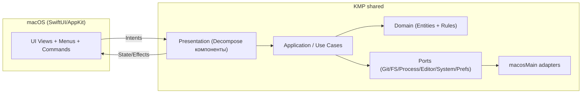

# План полного порта `worktree-manager` на KMP (macOS-first)

## Цель

- В `Swift` остаются только `UI` и app entrypoint.
- Вся бизнес-логика, состояние, навигация presentation и инфраструктурные интеграции переносятся в `shared`.
- Режим работы целевой сборки: `PORT_SYNC_NON_UI_SWIFT_PRUNE=YES`.
- Покрываем сразу весь функционал: repositories/worktrees/status/PR/settings/editors/help/menus/kanban.
- Мультиязычность сразу обязательная: `en` (default), `ru`, `uk`.

## Целевая архитектура

## Этапы выполнения

### 0) Freeze цели и границ

- Фиксируем правило: никакой новой non-UI `Swift` логики.
- Делим текущий `Swift` код на:
  - `оставляем`: `WorktreeManager/UI/**`, `WorktreeManager/App/**` (entry + wiring),
  - `удаляем после переноса`: `Application/**`, `Domain/**`, `Infrastructure/**`, `Presentation/**`, `DecomposeKit/**`.
- Фиксируем parity-матрицу экранов/действий и owner для каждого пункта.

Результат: понятный список того, что переносится в `shared`, без серых зон.

### 1) Shared contracts и error/i18n контракты

- В `bridge/commonMain` фиксируем единые контракты ошибок:
  - `DomainFailure` на границе domain/use-cases,
  - `UiError` + `UiText(key,args)` на границе presentation → UI.
- Полный набор i18n-ключей для первого полного релиза (`en/ru/uk`), без fallback на missing keys.
- В `shared` фиксируем публичные модели/DTO, которые реально нужны UI.

Результат: UI не опирается на legacy Swift-модели, только на `Shared*` API.

### 2) Полный перенос application/data/infrastructure в shared

- `bridge/macosMain` реализует реальные адаптеры:
  - `Git` (worktrees, branches, status, push/pull, merge, PR, lock/unlock/prune),
  - `Preferences` (base path, expanded repos, selected repo/worktree, editor prefs, copy patterns),
  - `Editor/System` opening,
  - `Process/FileSystem` где нужно.
- Все use-cases переводим на эти порты и убираем дублирование в `Swift`.

Результат: runtime-функционал вне UI выполняется только в `shared`.

### 3) Полный перенос presentation в shared (Decompose)

- В `bridge/commonMain` собираем `Root/Workspace/Settings/...` компоненты.
- Для всех сценариев заводим `State + Intent + Effect`:
  - sidebar selection / repository-worktree lifecycle,
  - команды меню и тулбара,
  - sheets (add repo, add worktree, create PR, complete worktree, editors, help),
  - kanban операции,
  - alert/openURL эффекты.
- Lifecycle и cancellation строго в компонентах shared.

Результат: `SwiftUI` только рендерит state и отправляет intents.

### 4) macOS UI wiring на прямых `Shared*` типах

- `SwiftUI` подключается напрямую к `Shared.framework`:
  - подписка на `SharedDecomposeValue`,
  - отправка intents в shared components/store.
- Локальные bridge-модели не используются.
- Допустимы только тонкие interop helpers:
  - async wrappers для completion-based Kotlin API,
  - конвертеры platform-specific типов (например, `NSNumber`/`Date`) без бизнес-правил.

Результат: UI слой тонкий и стабильный, без дублирования логики shared.

### 5) Выключение legacy Swift non-UI слоя

- Включаем `PORT_SYNC_NON_UI_SWIFT_PRUNE=YES` как default.
- Удаляем/исключаем legacy директории non-UI `Swift`.
- Чистим все импорты/ссылки на удалённые Swift-слои.

Результат: проект физически не содержит активной non-UI логики в `Swift`.

### 6) Полный parity-check по фичам

- Репозитории:
  - add/remove/archive/restore/select/refresh.
- Worktrees:
  - create/list/select/status/lock/unlock/remove/prune/open in finder/terminal/editor.
- Branch/PR:
  - load branches, create PR, open PR, push/pull, merge, delete local/remote branch.
- Settings:
  - worktree base path, copy patterns (global + per-repo), editors (enable/disable, remember choice).
- Help/Menu/Commands:
  - все пункты меню и шорткаты работают через shared intents/effects.
- Kanban:
  - add/move/reorder/delete task в рамках shared state.

Результат: визуально и функционально macOS-клон соответствует старому приложению.

## Контроль качества и gate

- `./gradlew :bridge:test`
- `./gradlew :bridge:check`
- `xcodebuild -project macosApp/macosApp.xcodeproj -scheme macosApp -configuration Debug -sdk macosx CODE_SIGNING_ALLOWED=NO PORT_SYNC_NON_UI_SWIFT_PRUNE=YES build`
- IDEA inspections по затронутым файлам/модулям без ошибок и предупреждений.

## Definition of Done

- Сборка и запуск macOS проходят в режиме `PORT_SYNC_NON_UI_SWIFT_PRUNE=YES`.
- В runtime нет зависимостей на legacy non-UI `Swift` код.
- Все ключевые сценарии parity-check проходят вручную и автотестами.
- i18n для `en/ru/uk` полная, без дыр.
