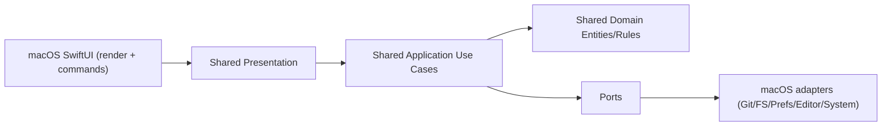

# BuildAndRun

BuildAndRun is a macOS-first Git worktree manager built with Kotlin Multiplatform (KMP).
It helps you run parallel branch workflows without constant stash/switch cycles: create worktrees, track status, push/pull, and finish branches after PR merge.

## What this project is

BuildAndRun provides one workspace for:

- repository management (add, remove, archive, restore)
- worktree lifecycle (create, lock/unlock, prune, finish)
- Git status visibility (modified, ahead/behind, clean)
- branch and PR flow (push/pull, create/open PR, cleanup)
- editor/system actions (open in editor, terminal, finder)

The product goal is clear separation of concerns: UI in SwiftUI, domain/application/presentation in shared KMP.

## Why it exists

Git worktrees are powerful but inconvenient from raw CLI for day-to-day multi-tasking.
BuildAndRun turns worktrees into a visual workflow so teams can:

- keep multiple feature/fix branches active in parallel
- reduce branch-switch friction and mistakes
- standardize “start -> code -> PR -> cleanup” flow

## Architecture (DDD + Clean Architecture)



## Repository layout

- `bridge/` - core app logic (domain, use cases, presentation state, ports)
- `macosApp/` - primary macOS app host and SwiftUI screens
- `composeApp/` - Compose Multiplatform app module (Android target)
- `iosApp/` - iOS host app scaffold

## Run locally

### macOS app (main target)

1. Open `macosApp/macosApp.xcodeproj` in Xcode.
2. Run scheme `macosApp`.

CLI build example:

```bash
xcodebuild -project macosApp/macosApp.xcodeproj \
  -scheme macosApp \
  -configuration Debug \
  -sdk macosx \
  CODE_SIGNING_ALLOWED=NO build
```

### Shared checks

```bash
./gradlew :bridge:allTests
./gradlew :bridge:check
./gradlew ktlintCheck
```

### Android module

```bash
./gradlew :composeApp:assembleDebug
```

## Current focus

The project is in active KMP migration to keep non-UI business logic in `shared` and leave Swift as UI/wiring only.
